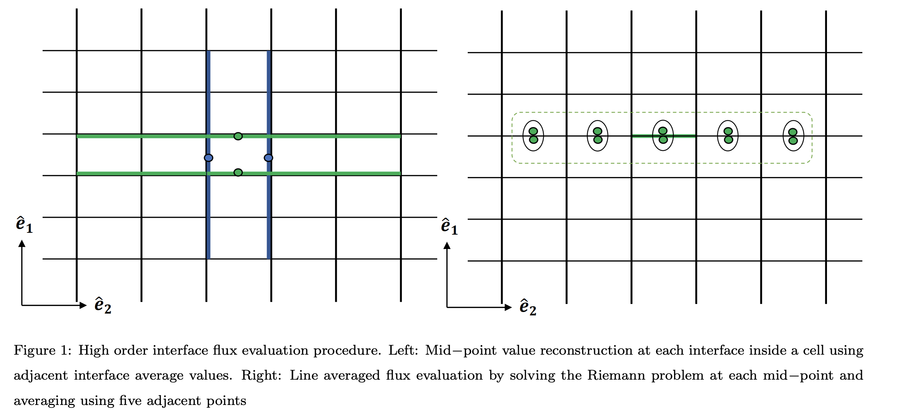
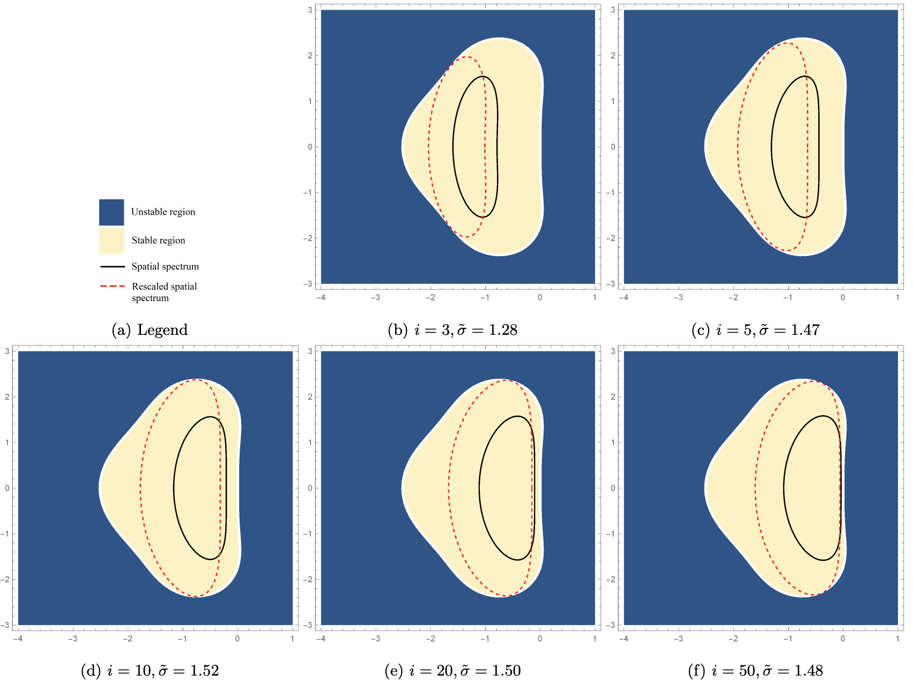

# WENO-curvilinear
This repository encloses Mathematica codes used in the paper [1] on Fifth order finite volume Weighted essentially non-oscillatory scheme in orthogonally-curvilinear coordinates.

The two Mathematica codes are as follows:
1. Weight derivation: For uniform grids in cartesian, cylindrical, and spherical coordinates
2. Modified von-Neumann stability analysis (as performed in [2])

  

Figure : Rescaled spectrums (with maximum stable CFL number ~ σ) and stability domains of fifth−order WENO−C in spherical coordinates (m = 2) in a complex plane for different index numbers i=40

Please cite paper [1], if using/extending the codes/work.

References:
1. Shadab, M.A., Balsara, D., Shyy, W. and Xu, K., 2019. Fifth order finite volume WENO in general orthogonally-curvilinear coordinates. Computers & Fluids (article in press). Link: https://doi.org/10.1016/j.compfluid.2019.06.031
2. Liu, H. and Jiao, X., 2016. WLS-ENO: Weighted-least-squares based essentially non-oscillatory schemes for finite volume methods on unstructured meshes. Journal of Computational Physics, 314, pp.749-773. Link: https://www.sciencedirect.com/science/article/pii/S0021999116001911 
